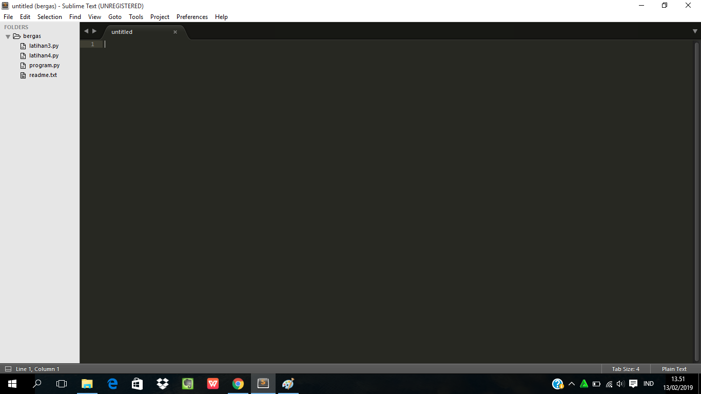
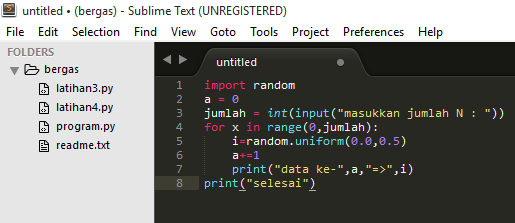
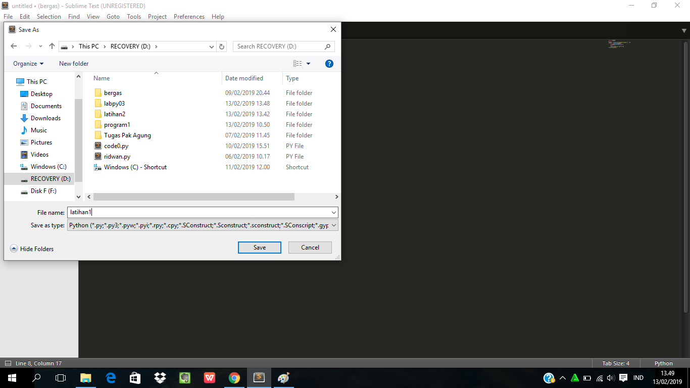
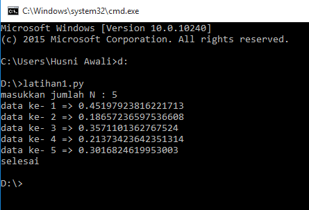
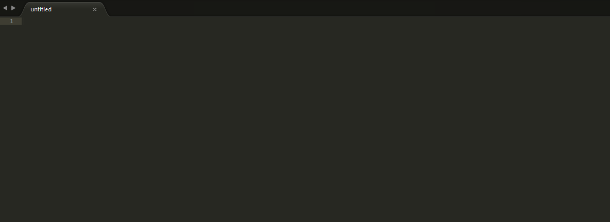
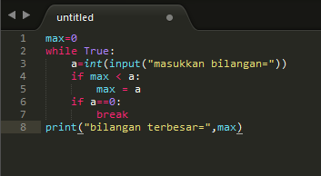
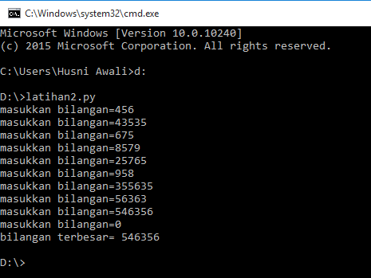
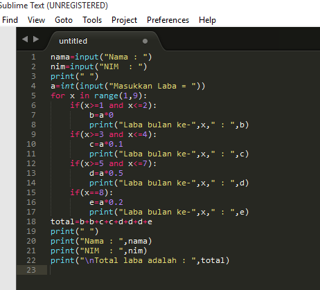
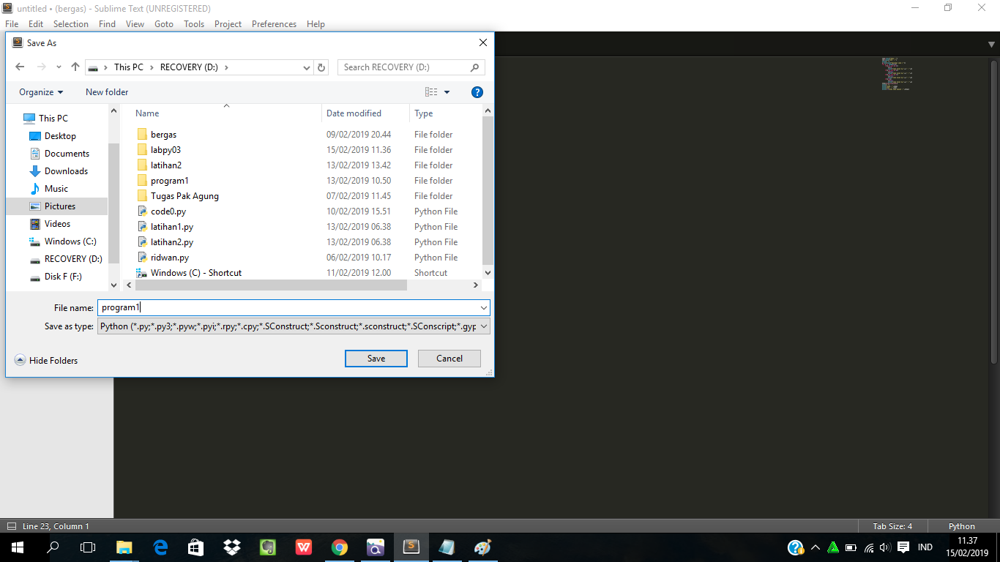
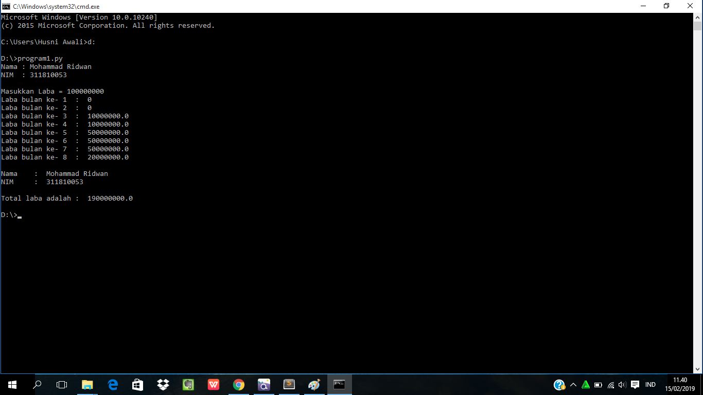

# labpy03

# Latihan1, cara membuat program bilangan acak yang lebih kecil dari 0,5

1. buka sublime text

2. masukan kode seperti berikut

3. lalu save program di data D

# Penjelasan Algoritma Latihan1.py

- masukan nilai N =5

- gunakan for range (untuk mengulang data dari 1-5)

- cetak data dan memasukan (random.uniform kurang dari 0.5)

- jika selesai RUN/jalankan programnya.

4. buka cmd dan masukan alamat atau lokasi penyimpanan file py(python), lalu masukan input program maka akan tampil hasil output seperti berikut

# Latihan2, cara membuat program untuk menampilkan bilangan terbesar dari n buah data yang diinputkan dan akan berhenti bila dimasukan angka 0

1. buka sublime text

2. masukan kode seperti berikut

3. lalu save program di data D

# Penjelasan Algoritma

- masukan max=0

- gunakan while True (untuk perulangan tak terbatas. jika bilangan tersebut bukan nol ,maka akan terus berulang ).

- gunakan if (jika memasukan bilangan nol maka perulangan akan berhenti).

- selanjutnya,gunakan if (untuk mencari nilai max = bilangan terbesar,lalu run/jalankan programnya).
 

4. buka cmd dan masukan alamat atau lokasi penyimpanan file py(python), lalu masukan input program, jika ingin menghentikan masukan input angka 0 maka akan tampil tampil hasil output seperti ini

# Program1, cara membuat program sederhana dengan perulangan

1. buka sublime text

2. masukan kode seperti berikut

3. lalu save program di data D

# Penjelasan Algoritma Program1.py

- masukkan nilai a

- gunakan for untuk perulangan dari 1 sampai 8

- lalu gunakan if pertama untuk menentukan laba bulan ke 1 dan ke 2.masukan variabel (b) kalikan nilai (a) dengan data bulan 1 dan 2. cetak (x) dan (b)

- lalu gunakan if kedua untuk menentukan laba bulan ke 3 dan ke 4.masukan variabel (b) kalikan nilai (a) dengan data bulan 3 dan 4. cetak (x) dan (c)

- lalu gunakan if ketiga untuk menentukan laba bulan ke 5 sampai ke 7.masukan variabel (b) kalikan nilai (a) dengan data bulan 5 sampai 7. cetak (x) dan (d)

- lalu gunakan if keempat untuk menentukan laba bulan ke 8.masukan variabel (b) kalikan nilai (a) dengan data bulan 8. cetak (x) dan (e)

- lalu total keseluruhan.

- cetak total

4. buka cmd dan masukan alamat atau lokasi penyimpanan file py(python), lalu masukan input program maka akan tampil hasil output seperti berikut

sekian terimakasih